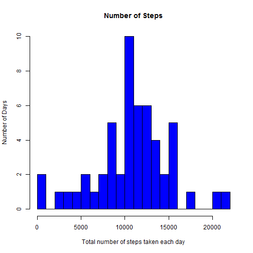
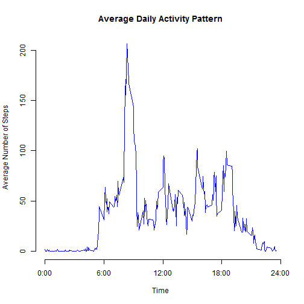
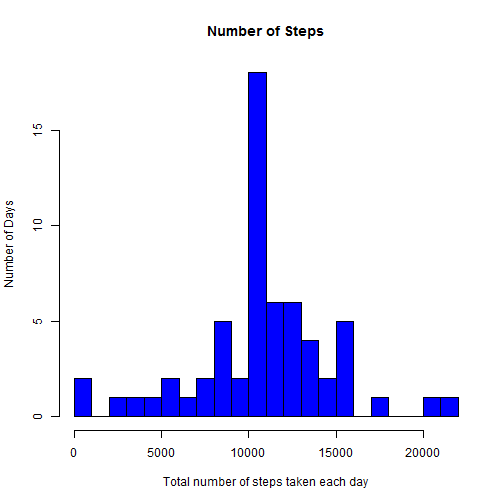

## Loading and preprocessing the data
* create a subset with Data NA removed (DNAR)


```r
data <- read.csv("activity.csv", header = T)

DNAR <- subset(data, is.na(data$steps) == F)
```

## What is mean total number of steps taken per day?

1. Calculate the total number of steps taken per day (TPD)
2. Make a histogram of the total number of steps taken each day


```r
library(plyr)
TPD <- ddply(DNAR, .(date), summarise, steps=sum(steps))
hist(TPD$steps, breaks = 20, main="Number of Steps", 
     xlab="Total number of steps taken each day", ylab = "Number of Days", col="blue")
```

 

3. Calculate and report the mean and median total number of steps taken per day


```r
mean(TPD$steps)
```

```
## [1] 10766.19
```

```r
median(TPD$steps)
```

```
## [1] 10765
```


## What is the average daily activity pattern?

1. Make a time series plot (i.e. type = "l") of the 5-minute interval (x-axis) and the average number of steps taken, averaged across all days (y-axis)

* calcluating the average number of steps taken in each 5-minite intervals (AVG)


```r
AVG <- ddply(DNAR, .(interval), summarise, steps=mean(steps))
plot(AVG$interval, AVG$steps,axes = F, type="l", 
    col="blue", 
    xlab="Time", 
    ylab="Average Number of Steps",
    main="Average Daily Activity Pattern")

axis(1,at=c(0,600,1200,1800,2400), 
    label = c("0:00","6:00","12:00","18:00","24:00"))
axis(2)
```

 

2. Which 5-minute interval, on average across all the days in the dataset, contains the maximum number of steps?


```r
AVG[which.max(AVG$steps),]
```

```
##     interval    steps
## 104      835 206.1698
```

* So it is the 5 minute interval from 8:35 !*

## Imputing missing values

1. Calculate and report the total number of missing values in the dataset (i.e. the total number of rows with NAs)


```r
sum(is.na(data$steps))
```

```
## [1] 2304
```

2. Devise a strategy for filling in all of the missing values in the dataset. The strategy does not need to be sophisticated.

* I will fill the NAs with average value for that 5-min interval !*

3. Create a new dataset that is equal to the original dataset but with the missing data filled in


```r
imputed <- data

for (i in 1:nrow(imputed)){
    if (is.na(imputed$steps[i])){
        imputed$steps[i] <- AVG$steps[which(imputed$interval[i] == AVG$interval)]}
}

imputed <- arrange(imputed, interval)
```

4. Make a histogram of the total number of steps taken each day and Calculate and report the mean and median total number of steps taken per day. Do these values differ from the estimates from the first part of the assignment? What is the impact of imputing missing data on the estimates of the total daily number of steps?

* calculating the total number of steps Impute (TPDI) taken each day


```r
TPDI <- ddply(imputed, .(date), summarise, steps=sum(steps))

hist(TPDI$steps, breaks = 20, 
     main="Number of Steps", 
     xlab="Total number of steps taken each day", 
     ylab = "Number of Days", 
     col="blue")
```

 

* Calculate and report the mean and median total number of steps taken per day on the imputed dataset !*


```r
mean(TPDI$steps)
```

```
## [1] 10766.19
```

```r
median(TPDI$steps)
```

```
## [1] 10766.19
```

```r
abs(mean(TPD$steps)-mean(TPDI$steps))
```

```
## [1] 0
```

```r
abs(median(TPD$steps)- median(TPDI$steps))/median(TPD$steps)
```

```
## [1] 0.0001104207
```

* so the mean didn't change after the imputing, !* 
* the median slightly changed about 0.1% of the original value.!*


* test how total steps taken per day differ


```r
DIFF <- sum(imputed$steps) - sum(DNAR$steps)
DIFF
```

```
## [1] 86129.51
```

* The difference shows - Impute the dataset cause the estimation on total steps per day to increase !*

## Are there differences in activity patterns between weekdays and weekends?

1. Create a new factor variable in the dataset with two levels -- "weekday" and "weekend" indicating whether a given date is a weekday or weekend day.


```r
Sys.setlocale("LC_TIME", "English") 
```

```
## [1] "English_United States.1252"
```

```r
imputed$weekdays <- weekdays(as.Date(imputed$date))
imputed$weekdays <- ifelse(imputed$weekdays %in% c("Saturday", "Sunday"),"weekend", "weekday")
```

2. Make a panel plot containing a time series plot (i.e. type = "l") of the 5-minute interval (x-axis) and the average number of steps taken, averaged across all weekday days or weekend days (y-axis).

* calcluating the average for each interval


```r
average <- ddply(imputed, .(interval, weekdays), summarise, steps=mean(steps))

library(lattice)
```

```
## Warning: package 'lattice' was built under R version 3.1.3
```

```r
xyplot(steps ~ interval | weekdays, 
       data = average, 
       layout = c(1, 2), 
       type="l", 
       xlab = "Interval", 
       ylab = "Number of steps")
```

 

** This completes all the requirements in Peer Assessment 1 !**

